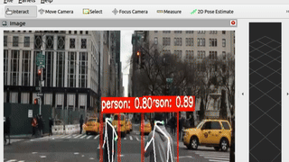
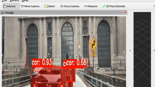

0<p align="center">
  
</p>

<h1 align="center">ROS 2 YOLOs-CPP</h1>
<h3 align="center">High-Performance ROS 2 Wrapper for YOLO Inference</h3>

<p align="center">
  <em>Production-grade, lifecycle-managed ROS 2 nodes for Object Detection, Segmentation, Pose, OBB, and Classification using <a href="https://github.com/Geekgineer/YOLOs-CPP">YOLOs-CPP</a>.</em>
</p>

<p align="center">
  <a href="https://github.com/Geekgineer/ros2_yolos_cpp/actions"></a>
  <a href="https://github.com/Geekgineer/ros2_yolos_cpp/blob/main/LICENSE"></a>
  <a href="https://index.ros.org/p/ros2_yolos_cpp/"></a>
</p>

---

## 🚀 Overview

**ros2_yolos_cpp** brings the blazing speed and unified API of [YOLOs-CPP](https://github.com/Geekgineer/YOLOs-CPP) to the robot operating system. It provides composable, lifecycle-managed nodes for the entire YOLO family (v5, v8, v11, v26, etc.).

---

## 🎬 Demo

<table align="center" cellpadding="10">
  <tr>
    <td align="center" style="border:1px solid #ccc">
      <b>Pose Estimation</b><br>
      
    </td>
    <td align="center" style="border:1px solid #ccc">
      <b>Object Detection</b><br>
      
    </td>
  </tr>
  <tr>
    <td colspan="2" align="center" style="border:1px solid #ccc">
      <b>Image Segmentation</b><br>
      
    </td>
  </tr>
</table>


---

### Key Features
- **⚡ Zero-Copy Transport**: Optimized for high-throughput image pipelines using `rclcpp::Subscription`.
- **🔄 Lifecycle Management**: Full support for `configure`, `activate`, `deactivate`, `shutdown` transitions.
- **🛠️ Composable Nodes**: Run multiple models in a single container for efficient resource usage.
- **📦 All Tasks Supported**: Detection, Segmentation, Pose, OBB, and Classification.
- **🏗️ Production Ready**: CI/CD tested, strictly typed parameters, and standardized messages (`vision_msgs`).

---

## 📥 Installation

### Prerequisites
- **ROS 2**: Humble or Jazzy
- **OpenCV**: 4.5+
- **ONNX Runtime**: 1.16+ (Auto-downloaded during build)

### Build from Source
```bash
# Create workspace
mkdir -p ~/ros2_ws/src && cd ~/ros2_ws/src

# Clone package
git clone https://github.com/Geekgineer/ros2_yolos_cpp.git

# Install dependencies
cd ~/ros2_ws
rosdep update && rosdep install --from-paths src --ignore-src -y

# Build (Release mode recommended for performance)
colcon build --packages-select ros2_yolos_cpp --cmake-args -DCMAKE_BUILD_TYPE=Release
source install/setup.bash
```

---

## 🛠️ Usage

This package provides a launch file for each task. You **must** provide paths to your ONNX model and (optionally) labels file.

### 1. Object Detection
Publishes `vision_msgs/Detection2DArray` with bounding boxes and class IDs.

```bash
ros2 launch ros2_yolos_cpp detector.launch.py \
    model_path:=/path/to/yolo11n.onnx \
    labels_path:=/path/to/coco.names \
    use_gpu:=true \
    image_topic:=/camera/image_raw
```

### 2. Instance Segmentation
Publishes `vision_msgs/Detection2DArray` and a synchronized mask image.

```bash
ros2 launch ros2_yolos_cpp segmentor.launch.py \
    model_path:=/path/to/yolo11n-seg.onnx \
    labels_path:=/path/to/coco.names \
    image_topic:=/camera/image_raw
```

### 3. Pose Estimation
Publishes `vision_msgs/Detection2DArray` with keypoints.

```bash
ros2 launch ros2_yolos_cpp pose.launch.py \
    model_path:=/path/to/yolo11n-pose.onnx \
    image_topic:=/camera/image_raw
```

### 4. Oriented Bounding Boxes (OBB)
Publishes custom `ros2_yolos_cpp/OBBDetection2DArray` with rotated bounding boxes.

```bash
ros2 launch ros2_yolos_cpp obb.launch.py \
    model_path:=/path/to/yolo11n-obb.onnx \
    labels_path:=/path/to/dota.names \
    image_topic:=/camera/image_raw
```

### 5. Image Classification
Publishes `vision_msgs/Classification`.

```bash
ros2 launch ros2_yolos_cpp classifier.launch.py \
    model_path:=/path/to/yolo11n-cls.onnx \
    labels_path:=/path/to/imagenet.names \
    image_topic:=/camera/image_raw
```

---
## 🔄 Nodes Configuration

Replace `<node_name>` with the appropriate name for your task:
- **Detection**: `/yolos_detector`
- **Segmentation**: `/yolos_segmentor`
- **Pose**: `/yolos_pose`
- **OBB**: `/yolos_obb`
- **Classification**: `/yolos_classifier`

### 1. Run Nodes
```bash
ros2 lifecycle set <node_name> configure
ros2 lifecycle set <node_name> activate
```

### 2. Close Nodes
```bash
ros2 lifecycle set <node_name> deactivate
ros2 lifecycle set <node_name> shutdown
```

---

## ⚙️ Configuration

Nodes can be configured via launch arguments or a YAML parameter file. See `config/default_params.yaml` for a template.

| Parameter | Type | Default | Description |
|-----------|------|---------|-------------|
| `model_path` | string | **Required** | Absolute path to `.onnx` model file. |
| `labels_path` | string | "" | Path to text file with class names (one per line). |
| `use_gpu` | bool | `false` | Enable CUDA acceleration (requires GPU build). |
| `conf_threshold` | double | `0.4` | Minimum confidence score to output detection. |
| `nms_threshold` | double | `0.45` | IoU threshold for Non-Maximum Suppression. |
| `image_topic` | string | `/camera/image_raw` | Topic to subscribe for input images. |
| `publish_debug_image` | bool | `true` | Publish standard `sensor_msgs/Image` with visualizations. |

### Topics

| Node Type | Subscriptions | Publications |
|-----------|---------------|--------------|
| **Detector** | `~/image_raw` | `~/detections` (Detection2DArray)<br>`~/debug_image` (Image) |
| **Segmentor** | `~/image_raw` | `~/detections` (Detection2DArray)<br>`~/masks` (Image)<br>`~/debug_image` |
| **Pose** | `~/image_raw` | `~/detections` (Detection2DArray)<br>`~/debug_image` |
| **OBB** | `~/image_raw` | `~/detections` (OBBDetection2DArray)<br>`~/debug_image` |
| **Classifier** | `~/image_raw` | `~/classification` (Classification)<br>`~/debug_image` |

---

## 🐳 Docker

Run the stack without installing dependencies locally.

```bash
# Build Docker image
docker build -t ros2_yolos_cpp .

# Run with GPU support
docker run --gpus all -it --rm \
    -v /path/to/models:/models \
    ros2_yolos_cpp \
    ros2 launch ros2_yolos_cpp detector.launch.py model_path:=/models/yolov8n.onnx
```

---

## 📄 License

This project is licensed under the **GNU Affero General Public License v3.0 (AGPL-3.0)**. See [LICENSE](LICENSE) for details.

<p align="center">
  Made with ❤️ by the <a href="https://github.com/Geekgineer/YOLOs-CPP">YOLOs-CPP Team</a>
</p>
